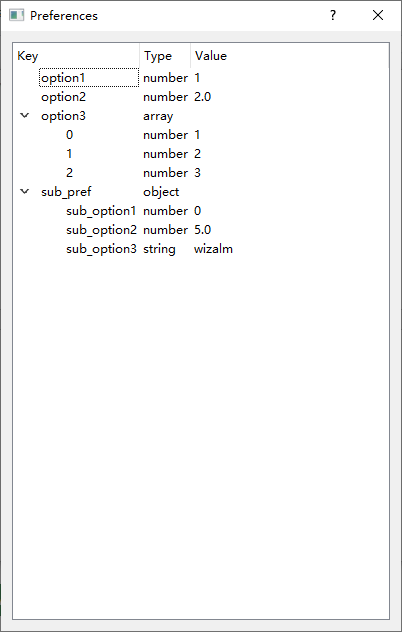

# QT通用配置文件库(QPreferences)
QPreferences项目是基于nlohmann/json的qt可视化配置文件库，将配置保存成json格式，并提供UI查看与修改，可通过cmake可快速添加进项目。默认支持基本类型、stl常用容器、基本类型与stl容器组成的结构体，若想添加不支持的类型，可参考nlohmann/json自行实现to_json和from_json函数。

## 项目使用步骤
### 1. 创建配置文件结构体
```c
QPREFERENCES_STRUCT(配置结构体名, 配置文件路径
                    , 类型1, 变量名1, 默认值1
                    , 类型2, 变量名2, 默认值2
                    ...
)
```
注意事项：
 - 配置文件路径可写绝对路径或相对路径，若为子配置结构体则写""
 - 变量名需要与json文件中的元素命名相同，否则会加载失败
 - 默认值必须要加括号，参考下一节示例
 - 最多支持40个变量(若不够则使用结构体嵌套，结构体算一个变量)
### 2.  在程序开头加载配置文件
&nbsp;&nbsp;&nbsp;&nbsp;&nbsp;&nbsp;&nbsp;&nbsp;通过上面的宏定义创建的结构体会继承QPreferences，QPreferences是一个单例类保证了全局只有一个配置结构体变量，通过GetInstance()接口返回配置结构体指针。QPreferences有三个可继承调用的成员函数`load()`、`save()`、`showUI()`，功能分别为加载、保存、显示配置文件。
&nbsp;&nbsp;&nbsp;&nbsp;&nbsp;&nbsp;&nbsp;&nbsp;一般情况下，我们需要在程序开头调用load()，否则参数都是默认值。当设置了配置文件路径且硬盘不存在该文件时，会自动创建json配置文件并写入默认值。创建配置文件在构造函数里判断是否要创建，一定会在执行load()之前，所以在程序开头放心load就好。
```c
MainWindow::MainWindow(QWidget *parent)
    : QMainWindow(parent)
    , ui(new Ui::MainWindow)
{
    ui->setupUi(this);
    Preferences::GetInstance()->load();
}
```
### 3.  将显示接口写入对应动作
```c
void MainWindow::on_pushButton_clicked()
{
    Preferences::GetInstance()->showUI();
}
```
## 示例
```c
#include "mainwindow.h"
#include "./ui_mainwindow.h"
#include "Preferences.h"

MainWindow::MainWindow(QWidget *parent)
    : QMainWindow(parent)
    , ui(new Ui::MainWindow)
{
    ui->setupUi(this);
    Preferences::GetInstance()->load();
}

MainWindow::~MainWindow()
{
    delete ui;
}

void MainWindow::on_pushButton_clicked()
{
    Preferences::GetInstance()->showUI();
}


```
Preferences.h源码
```c
#pragma once

#include <QPreferences.hpp>
#include <vector>
#include <string>

QPREFERENCES_STRUCT(SubPref, ""
                    , int           , sub_option1, (0)
                    , double        , sub_option2, (5.0)
                    , std::string   , sub_option3, ({"wizalm"})
                    )

QPREFERENCES_STRUCT(Preferences, "Preferences/Preferences.json"
                    , int               , option1   , (1)
                    , double            , option2   , (2)
                    , std::vector<int>  , option3   , ({1, 2, 3})
                    , SubPref           , sub_pref  , ()
                    )

```
配置文件显示，双击可修改，会修改后会判断输入值是否与原本类型兼容，若不兼容则输入无效。

